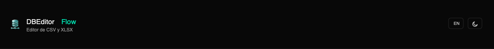

<div align="center">
  
</div>

# DBEditor Flow

**CSV & XLSX Editor**

  

**Versión en español:** [README.md](README.md)

A standalone editor for CSV, TSV and XLSX files. No npm dependencies, no build step — a minimal Node.js HTTP server serves a static frontend with native ES modules. Extracted from the integrated editor in DataB Flow.

---

## What it does

Load a CSV, TSV or XLSX file and edit it directly in a spreadsheet-style interface:

- Edit cells directly with a double-click
- Split columns by delimiter
- Delete, add, reorder and rename columns
- Format: uppercase/lowercase, trim spaces, find & replace, add text, number/currency/percent/date presets
- Remove characters by position (start or end)
- Merge: combine two columns into one
- Undo / redo (up to 30 steps)
- Export the result as CSV in one click
- Bilingual interface (**Spanish / English**) with **dark and light theme**

---

## Before you start: install Node.js

DBEditor Flow requires **Node.js v14 or higher**. If you already have it installed, skip this step.

### Mac

1. Open your browser and go to **https://nodejs.org**
2. Click the green **"LTS"** button (recommended version)
3. A `.pkg` file downloads — double-click it and follow the installer
4. To verify, open the **Terminal** app (`⌘ + Space`, type "Terminal") and run:
   ```bash
   node --version
   ```
   You should see something like `v22.0.0` or higher.

### Windows

1. Open your browser and go to **https://nodejs.org**
2. Click the green **"LTS"** button (recommended version)
3. A `.msi` file downloads — double-click it and follow the installer (keep all default options)
4. To verify, open **Command Prompt** (search "cmd" in the Start menu) and run:
   ```
   node --version
   ```
   You should see something like `v22.0.0` or higher.

### Linux (Ubuntu / Debian)

Open a terminal and run:

```bash
curl -fsSL https://deb.nodesource.com/setup_lts.x | sudo -E bash -
sudo apt-get install -y nodejs
```

For other distros (Fedora, Arch, etc.), follow the instructions at **https://nodejs.org/en/download/package-manager**

---

## Downloading DBEditor Flow

### Option A — ZIP (easiest, no extra installs)

1. Go to the project's GitHub page
2. Click the green **"Code"** button
3. Select **"Download ZIP"**
4. Unzip the file into the folder of your choice (e.g. `Documents/dbeditor-flow`)

### Option B — git clone

```bash
git clone https://github.com/mdmarein/dbeditor-flow.git
cd dbeditor-flow
```

---

## Running the application

There are two ways to start DBEditor Flow: from the terminal, or as a desktop app with an icon.

---

### Option 1 — From the terminal

#### Mac / Linux

Open a terminal in the project folder and run:

```bash
node server.js
```

#### Windows

Open Command Prompt in the project folder and run:

```
node server.js
```

---

### Option 2 — Install as an app with an icon (recommended)

You can create a desktop shortcut with an icon to open DBEditor Flow with a double-click, without using the terminal.

#### Mac — Create "DBEditor Flow.app"

1. Open a terminal in the project folder
2. Run:
   ```bash
   bash tools/make-mac-app.sh
   ```
3. **"DBEditor Flow.app"** is created on your Desktop
4. **First time:** right-click the icon → **Open** (macOS asks for confirmation once)
5. **After that:** just double-click

> The app starts the server automatically and opens your browser at `http://localhost:3100`.  
> If the server is already running, it just opens the browser.

#### Windows — Create a shortcut

1. Open the project folder in File Explorer
2. Go into the `tools` folder
3. Double-click **`make-win-shortcut.bat`**
4. **"DBEditor Flow"** is created on your Desktop
5. Double-click the icon to start the app

> If you get a permissions error, right-click → **Run as administrator**.

---

### Opening the app in your browser

If you used the terminal option, with the server running open your browser and go to:

```
http://localhost:3100
```

If you used the installed icon, the browser opens automatically.

To stop the server from the terminal: press `Ctrl + C`.

**Change port (optional):**
```bash
PORT=8080 node server.js          # Mac / Linux
set PORT=8080 && node server.js   # Windows
```

---

## Usage guide

### Import a file

Drag your CSV, TSV or XLSX file onto the screen (or click to browse). The app automatically detects:
- The separator (comma `,`, semicolon `;` or tab `\t`) — for CSV/TSV
- The file encoding — for CSV/TSV

For **XLSX** files: only the first sheet is read. Formulas show their cached value. Date-formatted cells appear as Excel serial numbers (they can be reformatted using the built-in format tool). Requires Chrome 80+, Firefox 113+ or Safari 16.4+.

### Edit

The table is paginated. You can edit a cell with a double-click, or use the tools in the sidebar:

| Tool | What it does |
|------|-------------|
| **Split** | Splits a column into two by delimiter |
| **Delete** | Removes one or more columns |
| **Add** | Inserts an empty column |
| **Reorder** | Changes the column order |
| **Rename** | Changes the header name |
| **Merge** | Combines two columns into one |
| **Format** | Applies number, currency, percent or date presets |
| **Case** | Converts values to uppercase or lowercase |
| **Spaces** | Trims leading/trailing spaces or removes all spaces |
| **Add text** | Adds a prefix or suffix to values |
| **Find & replace** | Replaces text in the column |
| **Remove by position** | Removes N characters from the start or end |

### Undo / redo

`↩` and `↪` buttons in the header — undo up to 30 steps.

### Export

**Download CSV** button — downloads the file with all changes applied.

---

## Language and theme

- **Language**: `EN`/`ES` button in the header. Switching language reloads the page.
- **Theme**: sun/moon button in the header, dark by default. Does not reload the page.

Both preferences are saved in `localStorage` and persist across sessions.

---

## API

| Route | Method | Description |
|-------|--------|-------------|
| `/api/prep-formats` | GET | Returns format presets (number, currency, percent, date) |
| `/api/prep-formats` | POST | Saves/updates the presets |
| `/api/health` | GET | Health check |

Any unrecognized route serves static files from `public/` with a fallback to `index.html`.

---

## Project structure

```
dbeditor-flow/
├── server.js                     HTTP server (no deps), 3 REST endpoints + static files
├── start.sh / start.bat          Manual start scripts (Mac/Linux · Windows)
├── tools/
│   ├── make-mac-app.sh           Creates DBEditor Flow.app on the Desktop (macOS)
│   ├── make-win-shortcut.bat     Creates a Desktop shortcut (Windows)
│   ├── launch-windows.vbs        Silent launcher (used by the Windows shortcut)
│   └── icons/                    AppIcon.icns · dbeditor-flow.ico · dbeditor-flow_icon.png
├── data/
│   └── prep-formats.json         Number/date format presets saved by the user
└── public/
    ├── index.html                 Shell: import screen + editor
    ├── css/styles.css
    ├── img/                       Favicons (16/32/192/512 + .ico) · logo · icon
    └── js/
        ├── editor-core.js         UI logic: table, sidebar, tools, inline editing
        └── modules/
            ├── parser.js           CSV parser/serializer (RFC 4180), auto-detects separator
            ├── xlsx-parser.js      Dependency-free XLSX parser (ZIP + native DecompressionStream)
            ├── prep.js             Pure column transformations (split, merge, format, etc.)
            ├── i18n.js             ES/EN dictionary
            └── utils.js            DOM helpers, toast, etc.
```

---

## Architecture

### What is it?

A standalone editor for CSV, TSV and XLSX files. Runs locally in the browser (`localhost:3100`), with a Node.js backend and a vanilla JavaScript frontend. No npm dependencies. 100% offline — the server only serves static files and saves format presets; all editing happens in the client.

### Tech stack

| Layer | Technology |
|-------|-----------|
| **Backend** | Pure Node.js (no Express), CommonJS, 0 external dependencies, 3 REST endpoints |
| **Frontend** | JavaScript ES6 modules + Vanilla JS, CSS3 variables for dark/light themes |
| **XLSX** | Native ZIP + XML parser (`DecompressionStream` + `DOMParser`) — no external libraries |
| **Undo/Redo** | Full CSV snapshot history in memory (up to 30 steps) |
| **Storage** | `data/prep-formats.json` for presets, `localStorage` for UI preferences |

### Data flow

```
CSV/TSV/XLSX → Client-side parsing → Paginated table
    → Editing tools (sidebar) → Pure transformations in prep.js
    → Undo/Redo (in-memory snapshots)
    → CSV export
```

### Key architecture decisions

- **Zero deps** — no `npm install`, easy to deploy on any Node.js environment
- **Everything client-side** — parsing, editing and export happen in the browser; the server only serves static files and persists format presets
- **XLSX without libraries** — the XLSX parser decompresses the `.xlsx` file (a ZIP) using the browser's native `DecompressionStream`; requires Chrome 80+, Firefox 113+ or Safari 16.4+
- **Pure transformations** — each operation is a `(csv) => newCsv` function in `prep.js`, never mutating state in place; makes undo/redo by snapshots straightforward
- **Inherited localStorage keys** — `datab-lang`, `datab-theme`, `editor_*` are inherited from DataB Flow, kept for compatibility

---

## License

GNU Affero General Public License v3.0 — see [LICENSE.md](LICENSE.md).

---

*DBEditor Flow · CSV & XLSX Editor · © 2026 mdmarein · GNU AGPLv3*
